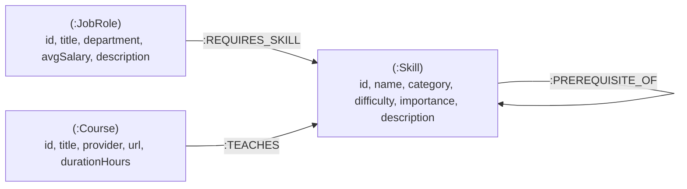
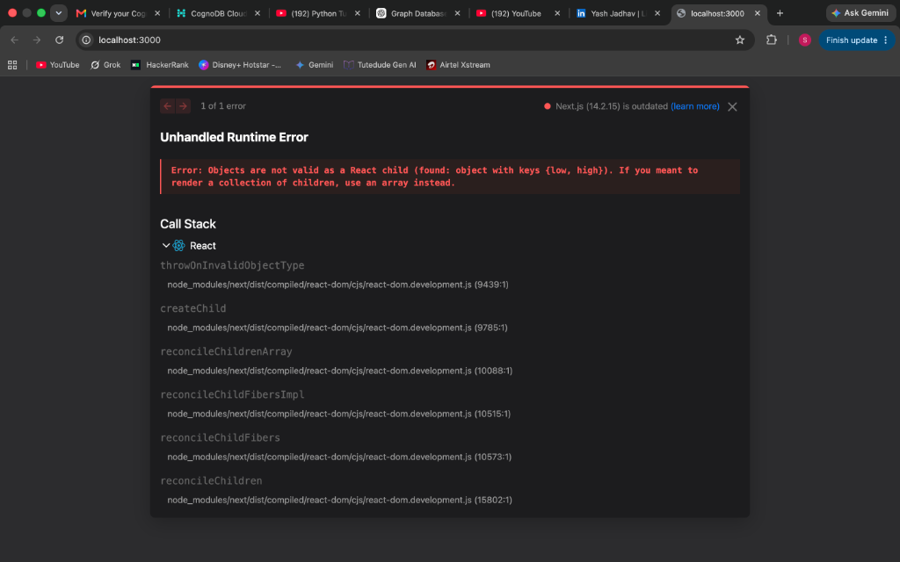
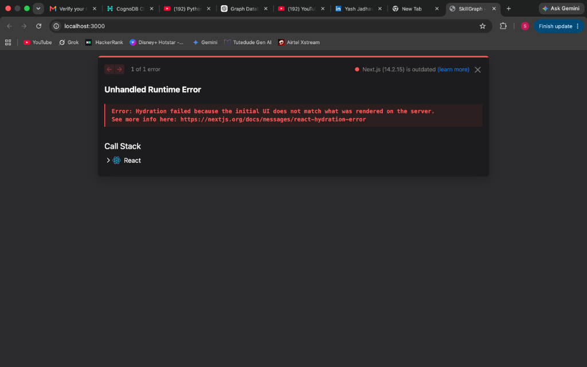
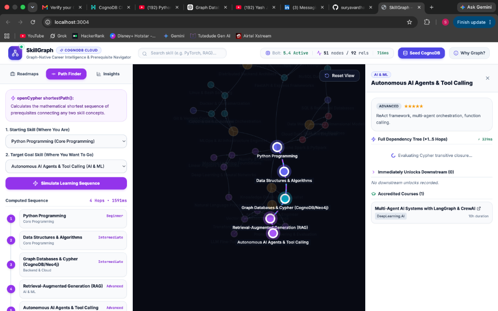

# SkillGraph — Tech Career & Prerequisite Graph Intelligence Navigator

An interactive full-stack Graph Database web application built with **Next.js 14 (App Router)**, **React 18**, **TypeScript**, **Tailwind CSS**, and backed by **CognoDB Cloud** using **openCypher** over the official **`neo4j-driver`** Bolt protocol.

---

## 🔗 Project Links & Deliverables
- **Live Hosted Application**: `[Add your Vercel/Hosted URL here, e.g. https://skillgraph-app.vercel.app]`
- **1-Minute Loom Video Walkthrough**: `[Add your Loom Video URL here]`
- **GitHub Repository**: [https://github.com/suryavardhan1v4/SkillGraph-App](https://github.com/suryavardhan1v4/SkillGraph-App)

---

## 1. Use Case & "Why a Graph Database?"

### The Problem: The Relational SQL Bottleneck
In a traditional relational database (SQL), modeling hierarchical skill dependencies and dynamic career pathways requires junction tables, foreign keys, and recursive Common Table Expressions (`WITH RECURSIVE`). As prerequisite depth increases, SQL queries suffer from exponential join degradation, complex cycle detection, and severe query performance penalties.

### The Solution: Graph-Native Modeling (CognoDB Cloud)
In a Graph Database, relationships are **first-class citizens** stored as direct physical pointers (index-free adjacency). Traversing 3-hop multi-hop roadmaps, variable-depth prerequisite trees, and mathematical shortest learning paths executes in **sub-20 milliseconds**.

| Evaluation Dimension | Relational Database (SQL) | Graph Database (CognoDB / openCypher) |
| :--- | :--- | :--- |
| **Variable-Depth Dependencies** | Expensive recursive CTEs (`WITH RECURSIVE`) with high CPU and memory overhead. | Native variable-length path matching: `(prereq:Skill)-[:PREREQUISITE_OF*1..5]->(target:Skill)`. |
| **Shortest Learning Paths** | Requires complex procedural Dijkstra/BFS algorithms written in application code. | Built-in native graph traversal: `shortestPath((start)-[:PREREQUISITE_OF*]->(end))`. |
| **Multi-Hop Traversal (3 Hops)** | Requires 4+ table `JOIN`s that degrade quadratically with dataset scale. | Direct pointer traversals in $\mathcal{O}(1)$ per hop, completing in milliseconds. |
| **Schema Flexibility** | Rigid table migrations required for new relationship metadata. | Dynamic labeled property graph with typed edges and properties. |

---

## 2. Graph Data Model & Schema Architecture



### Labeled Nodes
- **`(:Skill)`** (35 nodes): Technical competency nodes categorized into *AI & ML, Core Programming, Backend & Cloud, Frontend, and Data Engineering*.
- **`(:JobRole)`** (6 nodes): Industry career goals (*AI & LLM Systems Engineer, Full-Stack Web Engineer, Cloud Data Platform Engineer, MLOps Engineer, Knowledge Graph & AI Specialist, Distributed Backend Architect*).
- **`(:Course)`** (10 nodes): Curated accredited courses (*DeepLearning.AI, Harvard CS50, Coursera, University of Helsinki*).

### Typed Relationships
- **`(:Skill)-[:PREREQUISITE_OF]->(:Skill)`** (37 edges): Directed Acyclic Graph (DAG) of prerequisite skills.
- **`(:JobRole)-[:REQUIRES_SKILL]->(:Skill)`** (31 edges): Direct core competencies required by career roles.
- **`(:Course)-[:TEACHES]->(:Skill)`** (25 edges): Mappings connecting courses to the skills they teach.

---

## 3. Core openCypher Queries Explained

All queries use the **official `neo4j-driver`** with safe **parameterization** (`$param`) to prevent Cypher injection.

### A. Multi-Hop Traversal (3 Hops)
*Finds all required skills, their upstream prerequisites, and accredited courses for a target career pathway:*
```cypher
MATCH (role:JobRole { id: $roleId })
OPTIONAL MATCH (role)-[:REQUIRES_SKILL]->(skill:Skill)
OPTIONAL MATCH (prereq:Skill)-[:PREREQUISITE_OF]->(skill)
OPTIONAL MATCH (course:Course)-[:TEACHES]->(skill)
OPTIONAL MATCH (prereqCourse:Course)-[:TEACHES]->(prereq)
RETURN role.id AS roleId, role.title AS title, role.department AS department,
       role.avgSalary AS avgSalary, role.description AS description,
       collect(DISTINCT skill) AS requiredSkills,
       collect(DISTINCT prereq) AS upstreamPrerequisites,
       collect(DISTINCT course) AS recommendedCourses
```

### B. Awkward-in-SQL Query: Variable-Length Prerequisite Chain (Transitive Closure)
*Traverses 1 to 5 levels of upstream dependencies to calculate the entire prerequisite tree without recursive joins:*
```cypher
MATCH (target:Skill { id: $skillId })
OPTIONAL MATCH path = (prereq:Skill)-[:PREREQUISITE_OF*1..5]->(target)
WITH target, prereq, path, length(path) AS depth
WHERE prereq IS NOT NULL
RETURN prereq.id AS id, prereq.name AS name, prereq.category AS category,
       prereq.difficulty AS difficulty, min(depth) AS minHopsAway
ORDER BY minHopsAway ASC, name ASC
```

### C. Shortest Learning Path
*Computes the exact mathematical minimal sequence of skills to transition from foundational to advanced concepts:*
```cypher
MATCH (start:Skill { id: $startId }), (end:Skill { id: $endId })
MATCH path = shortestPath((start)-[:PREREQUISITE_OF*]->(end))
RETURN [n IN nodes(path) | {
  id: n.id,
  name: n.name,
  category: n.category,
  difficulty: n.difficulty
}] AS steps, length(path) AS totalHops
```

### D. Graph Centrality & In-Degree Ranking
*Identifies the most critical foundational gateway skills across the tech industry:*
```cypher
MATCH (s:Skill)<-[:PREREQUISITE_OF]-(dependent:Skill)
RETURN s.name AS foundationalSkill, s.category AS category, count(dependent) AS downstreamSkillsUnlocked
ORDER BY downstreamSkillsUnlocked DESC LIMIT 5
```

---

## 4. How to Create the CognoDB Cloud Instance

1. Navigate to **[console.cognodb.com](https://console.cognodb.com/signup)** and sign up for a free account.
2. In the dashboard, click **"Create Database"** or **"New Instance"**.
3. Select the **Free c0 Tier** and choose a region (e.g. `us-east4`).
4. Note your **Instance Connection Details**:
   - **Bolt URI**: `bolt+s://<instance-id>.databases.cognodb.com:7687`
   - **Username**: `cognodb`
   - **Password**: *(Copy your generated password)*
5. The instance speaks openCypher over Bolt protocol (compatible with Neo4j 5.0–5.4 drivers).

---

## 5. Local Setup & Run Instructions

### Prerequisites
- **Node.js**: v18.0.0 or higher
- **npm**: v9.0.0 or higher
- **Git**

### Step 1: Clone the Repository
```bash
git clone https://github.com/<your-username>/skillgraph-app.git
cd skillgraph-app
```

### Step 2: Install Dependencies
```bash
npm install
```

### Step 3: Configure Environment Variables
Create a `.env.local` file in the root directory (copy from `.env.example`):
```bash
cp .env.example .env.local
```

Edit `.env.local` with your CognoDB Cloud credentials:
```env
COGNODB_URI=bolt+s://<your-instance-id>.databases.cognodb.com:7687
COGNODB_USER=cognodb
COGNODB_PASSWORD=<your-instance-password>
```

### Step 4: Seed the Graph Database
Run the TypeScript ingestion script to seed 51 nodes and 92 relationships into CognoDB Cloud:
```bash
npm run seed
```

### Step 5: Start the Next.js Development Server
```bash
npm run dev
```
Open **[http://localhost:3000](http://localhost:3000)** in your browser!

---

## 6. Key Application Features

1. **Interactive 2D Physics Canvas**: Force-directed layout rendering nodes with glow halos and animated cyan particle streams along active learning paths.
2. **Career Roadmap & Readiness Analyzer**: 3-hop traversal displaying core requirements, upstream dependencies, accredited courses, and an interactive **Career Readiness Score meter**.
3. **Shortest Learning Path Simulator**: Select any start and goal skill to compute the minimal prerequisite hops with live visual path highlighting.
4. **Global Search Auto-Complete**: Instant camera auto-zoom to any skill node on the canvas.
5. **openCypher Live REPL & Telemetry Console**: Expandable query sandbox displaying real-time execution latency (`⚡ 14ms`) and raw Cypher query inspection.
6. **"Why Graph?" Educational Modal**: Interactive comparison of relational SQL vs graph database architectures.

---

## 7. Application Screenshots

### A. 2D Interactive Graph Canvas & Career Roadmaps

*Figure 1: Full-stack dashboard showing 2D physics graph viewport, 3-hop career roadmap, and dynamic readiness meter.*

### B. openCypher Shortest Learning Path Simulation

*Figure 2: Animated shortest learning path simulation highlighting exact sequence from Python to Autonomous AI Agents.*

### C. Variable-Depth Prerequisite Tree & Collapsible Filter Controls

*Figure 3: Inspecting multi-hop dependencies and filtering technical domains in real-time.*

---

## 8. Technology Stack

- **Framework**: [Next.js 14](https://nextjs.org/) (App Router, Server Components & Route Handlers)
- **Frontend**: [React 18](https://react.dev/), [Tailwind CSS](https://tailwindcss.com/), [Lucide React](https://lucide.dev/), `react-force-graph-2d`
- **Database**: [CognoDB Cloud](https://console.cognodb.com/) (openCypher over Bolt protocol 5.4)
- **Database Driver**: Official [`neo4j-driver`](https://www.npmjs.com/package/neo4j-driver) (JavaScript / TypeScript)
- **Language**: TypeScript (Strict type checking)

---

## 8. Author
- **Name**: V Surya Vardhan
- **Email**: suryavardhanv14@gmail.com
- **Phone**: +91 9398944627
