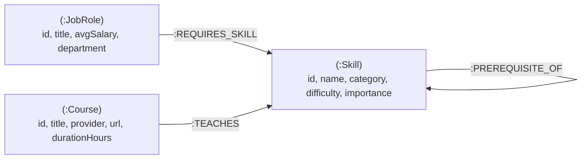

# SkillGraph — Tech Career & Prerequisite Graph Navigator

A modern, interactive full-stack Graph Database web application built with **Next.js (App Router)**, **React**, **TypeScript**, **Tailwind CSS**, and backed by **CognoDB Cloud** using **openCypher** over the official **Neo4j driver** (`neo4j-driver`).

---

## 1. Why a Graph Database? (Graph vs. Relational SQL)

In a relational database (SQL), modeling hierarchical skill dependencies and dynamic career paths requires junction tables, foreign keys, and recursive Common Table Expressions (CTEs). As dependency depth increases, SQL queries suffer from severe performance penalties and cognitive complexity.

| Requirement | Relational Database (SQL) | Graph Database (CognoDB / openCypher) |
| :--- | :--- | :--- |
| **Variable-Depth Prerequisites** | Requires expensive Recursive CTEs with manual cycle detection (`UNION ALL`). | Native variable-length path matching: `(prereq:Skill)-[:PREREQUISITE_OF*1..5]->(target:Skill)`. |
| **Shortest Learning Paths** | Requires custom breadth-first search (BFS) algorithms in application code. | Built-in native traversal: `shortestPath((start)-[:PREREQUISITE_OF*]->(end))`. |
| **Multi-Hop Traversal (3 Hops)** | Requires 4+ table `JOIN`s that degrade quadratically with dataset growth. | Direct index-free adjacency traversal in milliseconds. |
| **Schema Evolution** | Rigorous schema migrations for new connection types. | Flexible property graph schema with labeled nodes and typed relationships. |

---

## 2. Graph Data Model



### Labeled Nodes
- **`(:Skill)`**: Discrete technical competency (e.g., `Python`, `Transformers`, `Vector Databases`, `React`, `Docker`).
- **`(:JobRole)`**: Industry target role (e.g., `AI & LLM Systems Engineer`, `Full-Stack Web Engineer`).
- **`(:Course)`**: Curated educational resources (e.g., `DeepLearning.AI`, `Harvard CS50`).

### Typed Relationships
- `(:Skill)-[:PREREQUISITE_OF]->(:Skill)` (Hierarchical DAG of dependencies)
- `(:JobRole)-[:REQUIRES_SKILL]->(:Skill)` (Core skills demanded by industry roles)
- `(:Course)-[:TEACHES]->(:Skill)` (Course mappings)

---

## 3. Core Cypher Queries Explained

All queries use the **official Neo4j JavaScript driver** with **safe parameterization** (`$param`).

### A. Multi-Hop Traversal (3 Hops)
*Finds all required skills, their upstream prerequisites, and courses that teach them for a target career role:*
```cypher
MATCH (role:JobRole { id: $roleId })
OPTIONAL MATCH (role)-[:REQUIRES_SKILL]->(skill:Skill)
OPTIONAL MATCH (prereq:Skill)-[:PREREQUISITE_OF]->(skill)
OPTIONAL MATCH (course:Course)-[:TEACHES]->(skill)
OPTIONAL MATCH (prereqCourse:Course)-[:TEACHES]->(prereq)
RETURN role.title AS title,
       collect(DISTINCT skill.name) AS requiredSkills,
       collect(DISTINCT prereq.name) AS upstreamPrerequisites,
       collect(DISTINCT course.title) AS recommendedCourses
```

### B. Awkward-in-SQL Query: Variable-Length Prerequisite Chain (Transitive Closure)
*Traverses 1 to 5 levels of upstream dependencies to calculate the entire prerequisite tree:*
```cypher
MATCH (target:Skill { id: $skillId })
OPTIONAL MATCH path = (prereq:Skill)-[:PREREQUISITE_OF*1..5]->(target)
WITH prereq, min(length(path)) AS depth
WHERE prereq IS NOT NULL
RETURN prereq.name AS prerequisite, depth AS hopsAway
ORDER BY depth ASC
```

### C. Shortest Learning Path
*Computes the minimal sequence of skills to transition from a foundational skill to an advanced target:*
```cypher
MATCH (start:Skill { id: $startId }), (end:Skill { id: $endId })
MATCH path = shortestPath((start)-[:PREREQUISITE_OF*]->(end))
RETURN [n IN nodes(path) | n.name] AS learningSteps, length(path) AS totalHops
```

---

## 4. Getting Started & Setup Instructions

### Prerequisites
- Node.js 18+ and npm
- A free **CognoDB Cloud** account ([console.cognodb.com](https://console.cognodb.com/signup))

### 1. Clone & Install Dependencies
```bash
git clone https://github.com/<your-username>/skillgraph-app.git
cd skillgraph-app

npm install
```

### 2. Configure Environment Variables
Create `.env.local` in the root directory:
```env
COGNODB_URI=bolt+s://<your-instance-id>.databases.cognodb.com:7687
COGNODB_USER=cognodb
COGNODB_PASSWORD=<your-generated-password>
```

### 3. Seed Database into CognoDB Cloud
```bash
npm run seed
```

### 4. Start Development Server
```bash
npm run dev
```
Open **`http://localhost:3000`** in your browser.

---

## 5. Technology Stack
- **Framework**: Next.js 14 (App Router)
- **Frontend**: React 18, Tailwind CSS, Lucide Icons, `react-force-graph-2d`
- **Database**: [CognoDB Cloud](https://console.cognodb.com) (openCypher over Bolt protocol)
- **Database Driver**: Official `neo4j-driver` (JavaScript/TypeScript)
- **Language**: TypeScript (Strict type safety)
